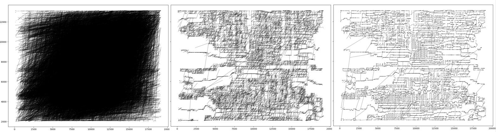

# Traveling Salesman Problem solver

TSP solver using greedy seeding (Nearest Neighbor) and local search (2-Opt or 3-Opt).  
Tries to find a path that results in lower distance traveled (lower fitness).

_Rough visualization (X, Y coordinate) of path found for rl11849.tsp : path with fitness 8 million (left), 3.5 million (middle), 1.5million (right)_

 

## Program specification

### Basic execution

Execute `tsp_solve.py` with TSP problem file, for example `rl11849.tsp`

→ `python tsp_solver.py rl11849.tsp`

 

### Flags

| flag | details                                                         | need additional number argument? | Default |
| :--: | :-------------------------------------------------------------- | :------------------------------: | :-----: |
|  -v  | verbose; print out progress                                     |                No                |  False  |
|  -m  | 3-Opt mode; add this flag to use 3-Opt instead of 2-Opt         |                No                |  False  |
|  -g  | goal for Nearest Neighbor initialization; set custom goal value |               Yes                |    0    |
|  -f  | limit the total number of fitness evaluations                   |               Yes                |  1000   |
|  -p  | population size (NOT USED)                                      |               Yes                |   -1    |

 

### Usage

Usage example : `python tsp_solver.py rl11849.tsp -m -v -g 1234567 -f 1234 -p 99999`

Flags can be skipped. Default value will be used for skipped flags.
`python tsp_solver.py rl11849.tsp`
`python tsp_solver.py rl11849.tsp -v -f 2500`

Order does not matter.
`python tsp_solver.py rl11849.tsp -v -f 2500`
`python tsp_solver.py rl11849.tsp -f 2500 -v`

Some flags require additional number argument.
Fail) `python tsp_solver.py rl11849.tsp -f`
Success) `python tsp_solver.py rl11849.tsp -f 2500`

 

## References

- TSP basics + NN init  
  http://tsp-basics.blogspot.com/2017/02/tour-construction-nearest-neighbor-nn.html

- 3-Opt  
  http://matejgazda.com/tsp-algorithms-2-opt-3-opt-in-python/

- TSP problem instances  
  http://elib.zib.de/pub/mp-testdata/tsp/tsplib/tsp/index.html
